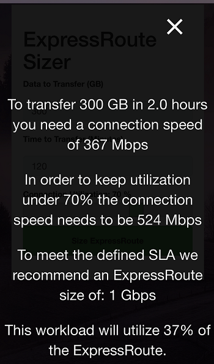

I had many asks to do a simple bandwidth sizer so here it is. The best part is this is all HTML, JavaScript, and CSS so you can use something like [static website hosting](https://docs.microsoft.com/en-us/azure/storage/blobs/storage-blob-static-website) on Azure Blob for a couple of pennies/month.

> Usage:
> 1. Select the amount of data you need to transfer in Gigabytes (GB)
> 2. Enter the time in minutes you need the transfer to complete
> 3. Specify how busy you want the connection to be for the data transer
>> Notes:
>> This was meant to be easy so options for tuning are deliberately limited. 
>> The only real one to understand is a hard-coded value of 10% extra bandwidth to account for TCP overhead and packet loss.

The site works well in a browser, and has a nice mobile format to boot.

----

----

