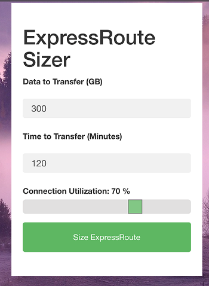

## I had many asks to do a simple bandwidth sizer so here it is. The best part is this is all HTML, JavaScript, and CSS so you can use something like [static website hosting](https://docs.microsoft.com/en-us/azure/storage/blobs/storage-blob-static-website) on Azure Blob for a couple of pennies/month.

## Simply select the amount of GB you need to transfer, the time in minutes you need the transfer to complete, and how busy you want the connection to be for the data transer.

## The site works well in a browser, and has a nice mobile format to boot.

----

----

